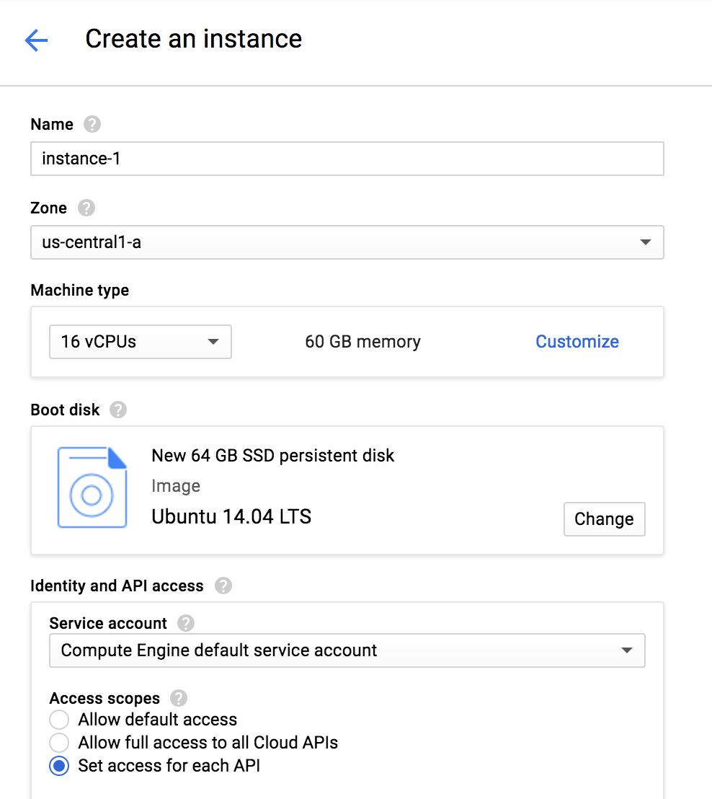
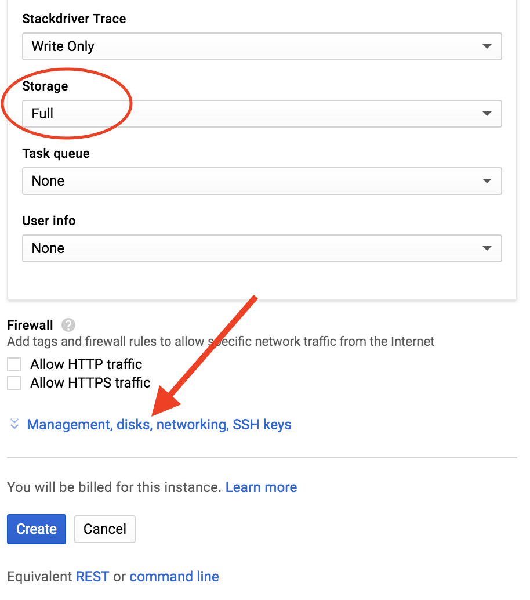
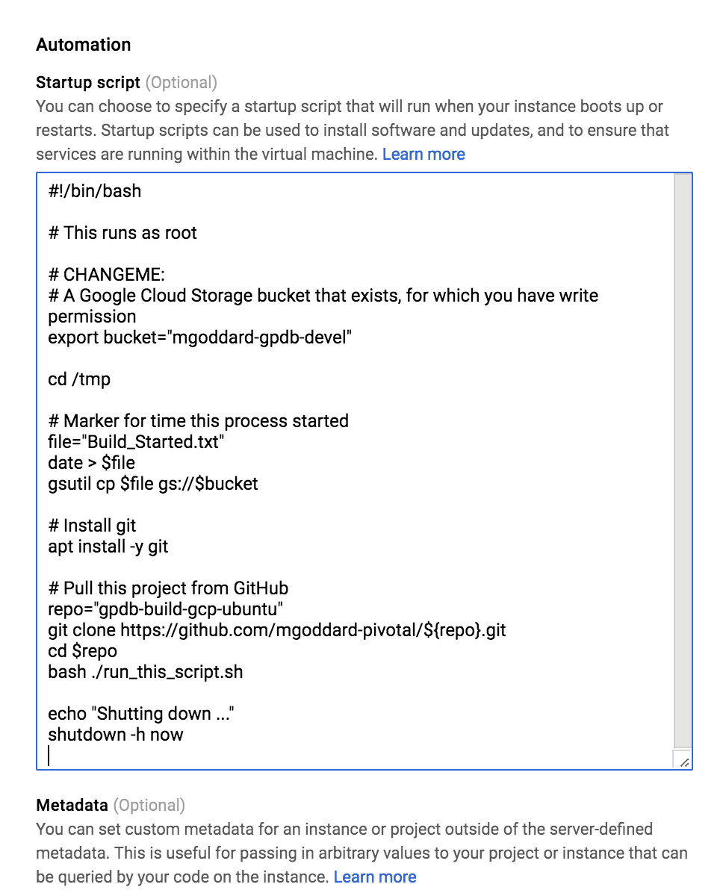

# Builds Greenplum DB (GPDB) for Ubuntu, on GCP

## This repo is used to generate a set of binaries for Greenplum DB (GPDB) on a VM deployed to Google Cloud Platform.

## Procedure

1. Obtain credentials for a Google Cloud Platform (GCP) project.  You will then have a `PROJECT_ID`.
1. Navigate to your GCP dashboard: `https://console.cloud.google.com/compute/instances?project=PROJECT_ID`
1. From the "VM Instances" menu, select "CREATE INSTANCE"
1. Customize the VM as illustrated in the figures, below, modifying the `./gpdb_build_gcp_startup_script.sh`
   (see `CHANGEME`) prior to copying it and pasting it into the "Startup Script" field under "Automation"
1. Finally, click the "Create" button

After about ten minutes, your compiled bits should be in the bucket you specified (`CHANGEME` in script),
and your VM should be stopped.

